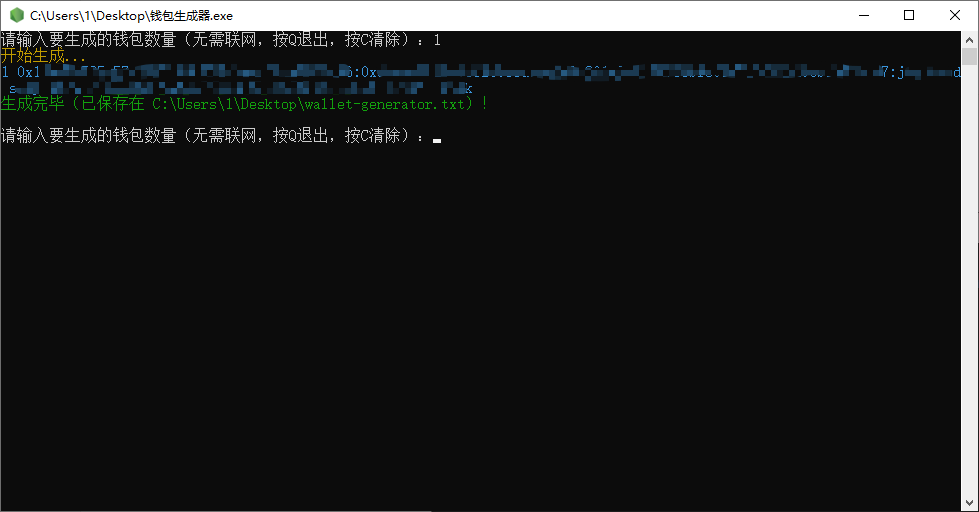
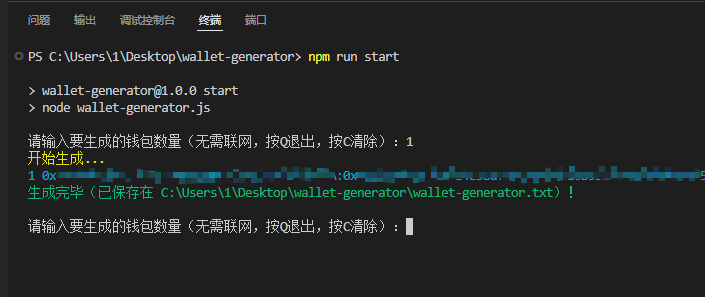

# wallet-generator

## 描述

用于在本地批量生成web3钱包（地址:私钥:助记词），钱包数据不上传，源码开源可放心使用。

## 以安装包方式运行

1. 下载安装包点击此处下载

2. 双击运行

3. 输入要生成的钱包数量，回车，即可生成，钱包信息会保存到与安装包相同目录下的wallet-generator.txt文件

   

## 以源码方式运行

环境：Node v18.18.0， npm 9.8.1

1. 安装依赖 `npm i`

2. 运行 `npm run start`

3. 输入要生成的钱包数量，回车，即可生成，钱包信息会保存到源码根目录下的wallet-generator.txt文件

4. （非必要）打包 npm run build

   

## 打赏

🙌你可以通过向下面的钱包打赏一杯咖啡来支持我

Ethereum Address: `0x5a8dA4865C450de6f0194325Be25e542B40ae7f9`